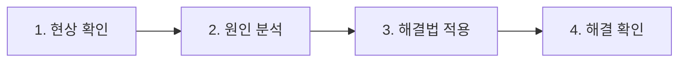

> *Production 이슈 분석을 요청하면 개발자는 무슨 일을 하는가*

프로덕트를 운영하다 보면 필연적으로 이슈 대응과 신규 기능 개발 사이에서 리소스 충돌이 생긴다. 이슈는 긴급하고, 개발 일정은 이미 잡혀 있다. 이 충돌을 해소하는 방법은 크게 세 가지다.

1. 이슈 발생 건수 줄이기
2. 유의미한 이슈만 분석해 처리 건수 줄이기
3. 이슈 분석과 해결에 걸리는 시간 단축하기

어떤 방향이든 전제가 있다. **개발자가 이슈 분석 과정에서 실제로 무슨 일을 하는지 팀 전체가 이해하고 있어야** 의미 있는 논의가 가능하다. 이 글은 그 이해를 돕기 위해 쓴다.

---

## 빠르고 정확한 이슈 분석이 중요한 이유

- 사용자가 겪고 있는 문제를 빠르게 해결해 **사용자 경험을 향상**시킨다.
- 같은 문제가 다른 사용자에게 반복되지 않도록 **해결책을 제품에 빠르게 반영**할 수 있다.
- 이슈의 근본 원인을 파악하면 **유사 문제를 사전에 방지**할 수 있다.
- 이슈 분석은 **신규 기능 개발의 퀄리티와 일정에 직접 영향을 끼친다.**

마지막 항목이 특히 중요하다. 이슈는 대부분 긴급 처리가 요구된다. 유저는 팀 내부 사정을 고려해주지 않기 때문이다. 그래서 이슈 분석은 진행 중인 모든 태스크를 뒤로 밀고 제1 우선순위로 올라오는 경우가 많다.

서비스 규모가 커질수록 이 부담은 기하급수적으로 증가한다. 이슈가 리포팅되는 모수 자체가 늘어나기 때문이다. 그리고 여기에는 **Negative Feedback 루프**가 숨어 있다.

> Negative Feedback 루프
> 리포트되는 이슈가 많아지면 → 분석에 드는 노력이 증가하고 → 신규 개발에 쏟을 리소스가 줄어든다. → 부족한 리소스로 만든 기능은 또 다른 이슈를 낳는다. → 반복.
>
> 이슈 분석을 잘 할 수 있는 환경을 갖추는 것은 단순한 효율 문제가 아니라 **서비스 생존의 문제**다.

---

## 이슈 분석 프로세스

네 단계로 나뉘지만, 핵심은 단연 **원인 분석**이다.

> 대부분의 이슈는 원인을 발견하는 순간 이미 절반 이상 해결된 것이나 다름없다. 나머지 세 단계를 모두 합친 노력보다 원인 분석에 드는 노력이 훨씬 큰 경우가 대부분이다.

원인을 찾지 못하면 이슈는 백로그에 미제로 남고, 미제 이슈는 복합적인 문제를 낳는다. 이슈 분석 프로세스를 개선한다는 것은 결국 원인 분석을 얼마나 빠르고 정확하게 할 수 있느냐의 문제다.

---

### 1. 현상 확인

개발자는 리포팅된 이슈가 실제 버그인지 먼저 판단한다. 최대한 많은 정보를 수집하고, 이 정보는 이후 원인 분석의 재료가 된다.

유저가 이슈라고 리포팅한 건이 모두 버그는 아니다. 의도한 대로 동작하지만 유저가 불편함을 느끼는 경우, 또는 사용법을 몰라 생기는 문제도 있다. 이 경우는 정책으로 해결하거나 개선 과제로 분리한다.

버그가 맞다면 **심각도와 서비스 영향도**를 판단해 분석 우선순위를 조정한다.

---

### 2. 원인 분석

이슈 분석의 핵심 단계다. 개발자는 수집된 정보를 무기 삼아 원인을 추론한다. **유의미한 정보가 많고 적음이 분석의 양상을 완전히 바꾼다.**

여기서 "유의미한" 정보란 개발자가 신뢰할 수 있는 정보를 말한다. 시스템이 직접 기록한 로그, 버전별로 관리되는 코드 등이 해당한다.

> 유저가 제공하는 정보는 100% 신뢰하기 어렵다
> 정보의 품질은 정보 제공자의 기술적 이해 범위를 벗어나지 못한다. 유의미하지 않은 정보를 사실로 믿으면 오히려 원인 분석을 더 어렵게 만든다.

> 정보의 양이 분석에 미치는 영향 — 예시
> 시골에 혼자 계신 할머니께 전화가 온다. 쇼핑몰에서 물건 주문이 안 된다고 하신다.
>
> **Case A.** "쇼핑몰에서 생수 사려는데 안 된다."
>
> **Case B.** "어제까지는 주문이 잘 됐는데 오늘은 주문하기 버튼을 누르면 '주문할 수 없다'고 나온다. 인터넷 연결은 문제없고, 다른 사이트 접속도 잘 된다. 로그인도 된다."
>
> Case A에서 전화로 문제를 해결하려면 직접 방문하는 게 더 빠를 수도 있다.

**정보가 충분한 경우 — 재현 기반 분석**

이슈를 재현할 수 있다면 원인 분석은 시간 문제다. 재현 환경에서 로깅을 강화하고 다양한 테스트를 해볼 수 있다. 정상 동작(Success Case)과 비교하는 것이 가장 기본적인 방법이다. 코드는 거짓말을 하지 않기 때문에, 충분한 시간을 투자하면 결국 근본 원인(Root Cause)에 도달한다.

**정보가 부족한 경우 — 시나리오 기반 추론**

정보가 부족하면 개발자는 이슈 시나리오를 가정하고 추론한다. 이는 전적으로 개발자의 경험과 실력에 의존한다. 재료가 적을수록 추론은 논리적 분석보다 상상에 가까워진다. 흔히 **"소설 쓰기"** 라고 부르는 과정이다.

> 재료 없이 소설 쓰는 예시
> 유저가 앱이 갑자기 종료됐다고 리포팅하고, 특별한 정보가 없는 경우.
>
> *iOS 버전이 원인일까?* → 16, 15, 14… 순서대로 테스트. 재현 안 됨.
>
> *사용 중 네트워크가 끊겼을까?* → 데이터 전송 중 강제 disconnect 테스트. 증상이 다름. 제외.
>
> 원인에 근접할 때까지 이 과정을 반복한다.

**대표적인 시나리오 기반 접근법**

| 방법 | 내용 |
|------|------|
| **인과적 요인 분석** | 이슈를 유발할 수 있는 조건을 Tree 구조로 나열하고 발생 가능성이 높은 것부터 가정 |
| **이벤트 분석** | 이슈를 유발할 수 있는 이벤트를 나열하고 유저 액션 타임라인을 설정해 추론 |
| **장벽 분석** | 코드에 심어 둔 방어 로직이 정상 동작한다는 전제로 시나리오를 좁힘 (예: *"비밀번호 불일치 로그가 없다면 비밀번호를 틀린 게 아니다"*) |
| **변화 분석** | 이슈 발생 시점 전후의 시스템 변경사항을 기반으로 시나리오 가정 (배포, 인프라 이슈 등) |

> *결국 개발자가 상상을 덜 할수록 분석은 빠르고 정확해진다. 상상을 줄이려면 신뢰할 수 있는 정보가 많아야 한다.*

---

### 3. 해결법 적용

같은 원인의 이슈를 해결하는 방법은 여러 가지다. 해결 속도, 안정성, 난이도, 확장성을 고려해 최선의 방법을 선택하고 적용한다.

---

### 4. 해결 확인

개발자가 자체 환경에서 문제 해결을 확인한다. 2단계에서 이슈 재현에 실패했다면 이 단계의 검증도 어렵다. 프로덕션에 배포 후 유저에게 문제가 재발하지 않는지 모니터링하고, 해결되지 않았다면 1단계로 돌아간다.

---

## 이슈 분석 환경을 갖추는 것이 핵심이다

서비스 규모가 커질수록 이슈 건수와 분석 난이도는 함께 올라간다. 원인을 찾지 못해 덮어둔 이슈, 기록조차 되지 않고 지나간 이슈들이 쌓이면 어느 순간 감당 불가능한 수준이 된다. **이슈 분석 환경은 문제가 쌓이기 전에 시스템적으로 갖춰야 한다.**

크게 두 가지 방향으로 나눌 수 있다.

**도구로 해결하는 부분**

- Sentry 같은 에러 트래킹 툴 도입 — 특히 클라이언트(앱) 환경은 서버보다 원인 분석이 어렵다. 앱이 실행되는 디바이스 환경은 팀이 통제할 수 없기 때문에, 신뢰할 수 있는 정보를 수집할 수 있는 도구가 더 절실하다.
- 인프라·코드 레벨 로깅 강화

**개발로 해결하는 부분**

- 코드 리팩토링을 통한 복잡도 감소
- CS 처리 프로세스 정비 — 유저로부터 유의미한 정보를 더 잘 수집할 수 있는 구조
